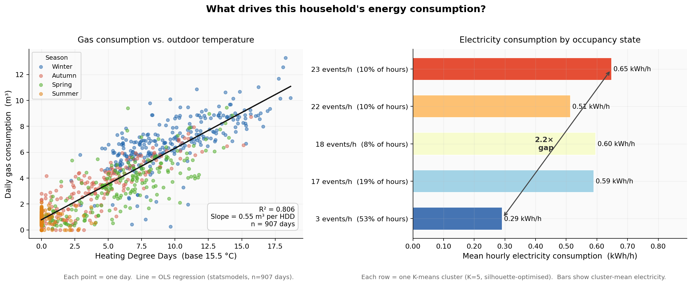

# SmartHomeEnergyAnalysis

**36 months of P1 meter data and a 29-month aligned analysis window from a single-family house in Nordwijk, NL —
built into a full analytical pipeline from raw files to insight.**

Developed in collaboration with **Statistics Netherlands (CBS)**.

---

## Executive Summary

Dutch households spend roughly **€2,400/year on energy** (2024 tariffs). Smart meters are near-universal, yet the data they generate is rarely used to understand *why* consumption varies day to day. CBS tasked this project with answering that question using real metering data from a single home in Nordwijk — P1 electricity and gas records spanning 36 months (Mar 2022 – Mar 2025), with a 29-month aligned analysis window (Oct 2022 – Mar 2025) when all four sources (electricity, gas, weather, and 40 IoT sensors) were simultaneously active.



The analysis works through the problem in layers:

| Question | Finding | Implication |
|----------|---------|-------------|
| What drives gas consumption? | HDD regression explains **80.6%** of daily gas variance; every degree-day below 15.5 °C adds **0.55 m³/day** | Baseline heating demand is predictable from weather alone — deviations signal equipment faults or behaviour change. Residuals show a slight autumn underestimate consistent with **thermal lag**: buildings retain summer warmth, delaying heating demand beyond what daily HDD captures. |
| Does occupancy matter for electricity? | The quietest cluster (53% of hours, 3 motion events/h) uses **0.29 kWh/h**; the busiest (23 events/h) uses **0.65 kWh/h** — a **2.2× gap** | Occupancy scheduling, not appliance replacement, is the primary lever for demand-side management |
| Can we forecast tomorrow's consumption? | Three models tested (naive, linear, LightGBM). For gas, **linear regression outperforms LightGBM** (MAE 0.70 vs 0.72 m³) — a near-linear physics process needs no tree complexity. For electricity, a **7-day motion rolling average adds consistent predictive value** beyond calendar features (ablation-confirmed); raw daily motion counts do not. | Model complexity should match signal complexity. Occupancy rhythm — not daily fluctuation — is the behavioural signal that generalises. |
| What is that worth? | Gas model reduces MAE by **0.19 m³/day (−21%)**, electricity by **0.16 kWh/day (−7%)**. At 2024 Dutch tariffs this represents an **upper-bound value of ~€70/household/year** — the savings ceiling if a smart thermostat could fully act on every percentage-point improvement in forecast accuracy. Realised savings depend on system integration and are typically 30–50% of this ceiling. | N=1; gas improvement scales to all 8M Dutch smart-meter households (weather + meter data only); electricity + occupancy requires in-home sensors (~15% penetration today) |

Three Jupyter reports and a live dashboard document every step — from raw files to policy-ready conclusions.

---

## What This Project Is

A household in Nordwijk, the Netherlands had its electricity meter, gas meter, and
~40 smart home devices (motion sensors, temperature sensors, door sensors, smart plugs,
etc.) generating data continuously from early 2022 through early 2025. This project
takes that raw, multi-format, overlapping data and turns it into a clean, queryable
database and a series of reproducible analyses.

The goal is twofold: demonstrate a complete data engineering + analytics workflow on
real-world messy data, and produce findings relevant to CBS's energy transition research.

---

## Dataset

| Source | Format | Resolution | Period | Rows (after dedup) |
|--------|--------|-----------|--------|--------------------|
| P1 electricity meter | CSV / CSV.gz | 15 min | Mar 2022 – Mar 2025 | 106,013 |
| P1 gas meter | CSV / CSV.gz | 15 min | Mar 2022 – Mar 2025 | 106,018 |
| SmartThings hub | TSV.gz | Event-driven | Oct 2022 – Apr 2025 | 1,725,906 |
| Open-Meteo weather | JSON (API) | 1 hour | Jan 2022 – Apr 2025 | 28,464 |

Raw files contain significant overlap between collection periods. The ETL pipeline
handles deduplication automatically — 52% of P1 rows and 27% of SmartThings rows
were duplicates across files.

---

## Technical Stack

```
Raw Files (CSV / TSV / JSON)
        │
        ▼
  ETL Layer  (Python CLI tools, Click)
  ├─ p1e.py              electricity ingestion
  ├─ p1g.py              gas ingestion
  ├─ smartthings.py      device message ingestion
  └─ openweathermap.py   weather fetch + ingestion
        │
        ▼
  SQLite Database  (SQLAlchemy ORM)
  └─ home_messages_db.py — sole database interface
        │
        ▼
  Analysis Layer  (Pandas, Matplotlib, Jupyter)
  └─ report_*.ipynb
```

**Languages & Libraries:** Python 3.13 · pandas 3.0 · SQLAlchemy 2.0 · Click · Matplotlib · Plotly · Dash · requests

---

## Project Structure

```
SmartHomeEnergyAnalysis/
├── home_messages_db.py            Database access class (sole DB entry point)
├── p1e.py                         CLI: load electricity data
├── p1g.py                         CLI: load gas data
├── smartthings.py                 CLI: load SmartThings device messages
├── openweathermap.py              CLI: fetch and store weather data
├── export_dashboard_data.py       Pre-compute dashboard cache from DB
├── app.py                         Interactive Dash dashboard
├── charts.py                      Pure figure-builder functions (testable, imported by app.py)
├── render.yaml                    Render.com deployment config
├── report_data_quality.ipynb      Data quality audit ✅
├── report_energy_analysis.ipynb   Comprehensive energy analysis ✅
├── report_forecasting.ipynb       Next-day energy forecasting ✅
├── .github/
│   └── workflows/test.yml         GitHub Actions CI (runs pytest on push/PR)
├── tests/
│   └── test_parsers.py            Unit tests for ETL parsers (pytest)
├── conftest.py                    pytest flat-layout path config
├── requirements.in                Direct dependencies (human-maintained)
├── requirements.txt               Pinned lockfile (pip-compile generated)
├── ANALYSIS_LOG.md                Decision and reflection log
├── data_cache/                    Pre-computed CSV + JSON for dashboard
│   ├── daily_energy.csv
│   ├── elec_heatmap.csv
│   ├── hourly_clusters.csv
│   ├── cluster_summary.csv
│   └── hdd_model.json
└── data/data/
    ├── P1e/                       Raw electricity files
    ├── P1g/                       Raw gas files
    └── smartthings/               Raw device message files
```

---

## Setup

```bash
git clone https://github.com/SnoozeJournalZzz/SmartHomeEnergyAnalysis.git
cd SmartHomeEnergyAnalysis

python3 -m venv .venv
source .venv/bin/activate       
pip install -r requirements.txt
```

---

## Running the Dashboard

```bash
# Generate pre-computed cache (required once after loading data)
python export_dashboard_data.py

# Launch the dashboard locally
python app.py
# → Open http://localhost:8050 in your browser
```

The dashboard reads only from `data_cache/` — the raw database is never deployed.
For production deployment, the `render.yaml` at the project root configures a Render.com web service (gunicorn, Python 3.13).

---

## Running Tests

```bash
pytest tests/
```

20 unit tests covering: electricity and gas ETL parsers, SmartThings parser,
UTC epoch conversion, DST edge cases (CET → CEST), and deduplication logic.

---

## Loading Data

Each tool is idempotent — re-running it skips already-loaded rows.

```bash
python p1e.py          -d sqlite:///myhome.db data/data/P1e/P1e-*.csv.gz data/data/P1e/P1e-*.csv
python p1g.py          -d sqlite:///myhome.db data/data/P1g/P1g-*.csv.gz data/data/P1g/P1g-*.csv
python smartthings.py  -d sqlite:///myhome.db data/data/smartthings/smartthings.*.tsv.gz
python openweathermap.py -d sqlite:///myhome.db --start 2022-01-01 --end 2025-03-31
```

Each tool supports `--dry-run`, `--info`, `-v`, and `--help`.

---

## Analyses

### `report_data_quality.ipynb` ✅
Full data audit across all four sources.
- One P1 meter outage (Jan 29–31 2024, 36.8 h) confirmed by cross-source epoch alignment
- SmartThings starts 7 months after P1 meter — common analysis window: Oct 2022 onward
- 8 devices went offline before dataset end; documented with exact dates and likely causes
- Blue room motion sensor gap: predecessor offline Jan 2023, replacement not installed until Jan 2024 — no single sensor covers the full window; occupancy analysis uses the 4 sensors that are continuously active
- Garden air temperature sensor: 2 physically impossible readings (417 °C, 209 °C) from firmware error; excluded from any temperature regression
- Weather (ERA5) complete and physically plausible; validated against in-situ garden sensor
- Closes with a quality scorecard and justified analytical roadmap

### `report_energy_analysis.ipynb` ✅
**Central question: what drives this household's energy consumption — weather, routine, or occupancy?**

Five-part decomposition over the 29-month aligned window (Oct 2022 – Mar 2025):

1. **Baseline patterns** — electricity and gas time series; daily/weekly heatmaps reveal stable two-peak routine
2. **Weather regression** — ERA5 validated against in-situ garden sensor (r=0.957, RMSE=2.2°C); HDD model explains **80.6%** of daily gas variance (slope: 0.55 m³/day per degree-day below 15.5°C); slope and intercept reported with both OLS and **HAC (Newey-West, maxlags=7) standard errors** — the estimate is robust to autocorrelation
3. **Behavioural patterns** — motion sensor heatmaps and door-open profiles confirm weekday departure/return clusters (08:00–09:00 / 17:00–18:00); consistent with electricity consumption peaks
4. **Occupancy detection** — K-means (K=6 by silhouette score) on 4-sensor hourly motion counts (Living Room, Bathroom, Kitchen ×2; Blue room excluded — no sensor covers the full window); low-activity cluster consumes **0.29 kWh/h** vs high-activity clusters at **0.65 kWh/h** (2.2× difference); **Kruskal-Wallis test confirms the gap is statistically significant across all six clusters (p < 0.001)**; DBSCAN confirms occupancy is a continuum rather than a binary switch
4b. **Occupancy validation** — door contact sensor events used as independent weak labels to validate K-means clusters; low-activity cluster is 65% *away* hours, highest-activity cluster is 71% *home* hours; logistic regression on 4-sensor counts achieves AUC=0.644 (vs 0.5 random), confirming the motion signal generalises across time; non-monotonic relationship between activity level and occupancy confirms the continuum finding from DBSCAN
5. **Synthesis** — variance decomposition: routine explains 15.4% of hourly electricity variance; adding occupancy state raises this to 23.2% (+7.8 pp); temperature adds a further 1.1 pp; 75.7% remains appliance-level noise not capturable at hourly resolution; sequential decomposition limitation acknowledged; Shapley-value decomposition noted as the order-independent alternative
6. **Appendix: Causal inference** — Interrupted Time Series (Event Study) design using the Jan 2024 outage as a natural experiment; OLS with HDD confounder control; **pre-trend test implemented** (regress residuals on `days_since` in pre-period only; slope ≈ 0 validates the parallel-trends assumption, or flags seasonal confounding if significant); parallel-trends assumption and its limitations fully discussed
7. **Business Implications** — three actionable recommendations derived directly from the findings: (1) automate heating against weather forecast, not habit — 80.6% of gas is already captured by HDD, manual adjustment adds nothing; (2) shift deferrable loads (EV, dishwasher) to quiet-occupancy windows identified by K-means — 2.2× gap is predictable, not random; (3) separate structural demand (HDD slope = building efficiency, responds to retrofit) from behavioural demand (occupancy multiplier, responds to TOU tariffs) for *Klimaatakkoord* policy design — these two levers are orthogonal and require different instruments

### `report_forecasting.ipynb` ✅
**Central question: given everything known at the end of today, how accurately can we predict tomorrow's electricity and gas consumption?**

Chronological train/test split: 25 months training (Oct 2022 – Oct 2024), 5-month test window (Nov 2024 – Mar 2025, a full winter). Gap masking logic (`>20 min intervals → NaN`, `min_count=80`) is identical to the analysis notebook — no hard-coded outage dates, consistent training data. Same-day weather features (`hdd`, `temp_c`) are explicitly documented as requiring a day-ahead weather forecast in deployment (Open-Meteo provides this; test evaluation uses observed values as a perfect-forecast proxy). Three models per target, evaluated on held-out test set:

| Model | Gas MAE | Electricity MAE |
|---|---|---|
| Naive (yesterday's value) | 0.894 m³ | 2.236 kWh |
| Linear regression | **0.702 m³** | 2.190 kWh |
| LightGBM (tuned via TSCV) | 0.723 m³ | 2.073 kWh |

Key findings:
- **Gas**: linear regression slightly outperforms LightGBM — the temperature–gas relationship is near-linear (as established by the HDD model), so additional model complexity provides no structural advantage
- **Electricity**: LightGBM with occupancy feature (`motion_roll7`, 7-day rolling mean of motion events) reduces MAE by 3.7% vs the no-occupancy baseline, confirming the predictive value of the Part 4 occupancy analysis
- **Feature form matters**: raw daily motion count (`motion_lag1`) *worsened* predictions; the weekly rolling mean captured the occupancy *rhythm* rather than day-level noise — consistent with Part 4's finding that occupancy operates at the weekly behavioural level
- **Time-series CV is not optional**: TSCV with expanding window selected n_estimators=50; using n_estimators=300 (the naive default) produced a model worse than the naive baseline
- **Residual analysis**: gas residuals show no day-of-week pattern (confirming the boiler responds to temperature, not routine); electricity residuals reveal systematic Saturday over-prediction, evidence of behavioural drift not captured by calendar features
- **Business impact**: the MAE improvements (gas −0.19 m³/day, electricity −0.16 kWh/day) represent an upper-bound value of ~€70/household/year at 2024 Dutch tariffs — the savings ceiling if a smart thermostat acted perfectly on every forecast improvement. Realised savings are typically 30–50% of this ceiling. Gas improvement scales to all 8M Dutch smart-metered households; electricity + occupancy requires in-home sensors (~15% penetration)

---

## Engineering Notes

**UTC epoch storage.** All timestamps converted to UTC integer seconds at ingestion.
Timezone logic (Europe/Amsterdam) is centralised in one utility function.

**Database-layer deduplication.** `INSERT OR IGNORE` on `PRIMARY KEY` / `UNIQUE` constraints.
O(1) per record; no memory-based pre-filtering needed even at 1.7M rows.

**SQLite batch limit.** SQLite caps SQL bound variables at 999. Batch size is computed
dynamically as `⌊999 / n_columns⌋` to stay within the limit for any table width.

**pandas 3.0 compatibility.** The default datetime precision changed from nanoseconds
(`datetime64[ns]`) to microseconds (`datetime64[us]`) in pandas 3.0. Epoch conversion
uses `.dt.tz_localize(None).astype("datetime64[s]").astype("int64")` to produce
correct second-precision integers regardless of the underlying precision.

---

## Skills Demonstrated

| Area | Details |
|------|---------|
| Data engineering | Multi-format ETL (CSV, TSV, JSON, gzip), schema design, deduplication |
| Python | SQLAlchemy ORM, Click CLI, modular architecture, virtual environment |
| Data cleaning | Timezone / DST handling, gap detection, anomaly classification |
| SQL | SQLite, parameterised queries, aggregate statistics |
| Data analysis | pandas, time-series, cross-source alignment |
| Visualisation | Matplotlib, Plotly Dash interactive dashboard |
| Statistics | OLS regression, HDD model, residual diagnostics (Breusch-Pagan heteroscedasticity test, Durbin-Watson autocorrelation test), **HAC / Newey-West robust standard errors**, K-means, DBSCAN, silhouette scoring, Kruskal-Wallis + Mann-Whitney U significance testing, variance decomposition, **pre-trend test for parallel-trends assumption** |
| Machine learning | LightGBM, logistic regression, feature engineering (lag/rolling), time-series cross-validation (expanding window), ablation testing, AUC evaluation |
| Causal inference | Interrupted Time Series / Event Study design, natural experiment identification, parallel-trends assumption, confound control (HDD) |
| Testing | pytest, 20 unit tests, DST edge cases, flat-layout conftest |
| Deployment | Render.com, gunicorn, pip-tools lockfile (requirements.in + requirements.txt) |
| Version control | Git, conventional commits |

---

# 中文说明

## 项目简介

本项目基于荷兰 Nordwijk 一户真实家庭的智能家居数据，由荷兰统计局（CBS）提供。P1 电表（电力 + 燃气）数据跨度 **36 个月**（2022 年 3 月至 2025 年 3 月）；四个数据源同时在线的对齐分析窗口为 **29 个月**（2022 年 10 月至 2025 年 3 月，SmartThings 传感器数据从 2022 年 10 月起有效）。

数据来源包括：P1 智能电表（电力 + 燃气，15 分钟分辨率）、约 40 个 SmartThings 智能家居设备（运动传感器、温度传感器、门磁、智能插座等），以及 Open-Meteo 提供的历史气象数据。

项目完整覆盖数据工程到分析的全流程：多格式原始文件 → ETL 清洗去重 → SQLite 关系型数据库 → 可复现的 Jupyter 分析报告。

---

## 数据规模

| 数据源 | 去重后行数 | 时间跨度 |
|--------|-----------|---------|
| 电力读数 | 106,013 | 2022-03 → 2025-03 |
| 燃气读数 | 106,018 | 2022-03 → 2025-03 |
| 智能设备消息 | 1,725,906 | 2022-10 → 2025-04 |
| 气象数据 | 28,464 | 2022-01 → 2025-04 |

原始文件之间存在大量时间段重叠，ETL 管道自动处理去重——P1 原始解析行中约 52% 为跨文件重复。

---

## 技术栈

- **语言：** Python 3.13
- **数据处理：** pandas 3.0、SQLAlchemy 2.0
- **CLI 工具：** Click
- **可视化：** Matplotlib
- **数据库：** SQLite
- **版本控制：** Git

---

## 分析

### `report_data_quality.ipynb` 数据质量审计

对四个数据源进行全面质量检验，主要发现：

- **P1 计量器断点**：2024 年 1 月 29–31 日，持续约 36.8 小时，经电力与燃气数据的 epoch 交叉比对确认为同一硬件故障
- **数据源对齐问题**：SmartThings 数据比 P1 数据晚启动约 7 个月，跨源分析的公共起点为 2022 年 10 月
- **设备生命周期**：8 台设备在数据集结束前已下线，均有明确日期记录和合理解释（如季节性圣诞树插座、被更换的锅炉）
- **蓝屋运动传感器覆盖缺口**：前代设备 2023 年 1 月下线，替换设备 2024 年 1 月才安装——无单一传感器覆盖完整分析窗口；占用聚类改用持续在线的 4 个传感器
- **花园气温传感器固件错误**：检测到 2 条物理非法读数（417°C / 209°C），已排除出气温回归分析
- **气象数据**：ERA5 再分析数据完整无缺口，已与花园传感器实地比对验证（r=0.957，RMSE=2.2°C）

### `report_energy_analysis.ipynb` 综合能耗分析

**核心问题：这个家庭的能耗，究竟由天气、作息规律还是在家状态驱动？**

五部分递进式分析，分析窗口为 2022 年 10 月至 2025 年 3 月：

1. **基线模式**：电力与燃气时间序列，小时×星期热力图揭示稳定的双峰作息规律
2. **天气回归**：供暖度日（HDD）模型解释每日燃气用量方差的 **80.6%**（斜率：15.5°C 以下每度日增加 0.55 m³/天）；OLS 残差经 Breusch-Pagan（异方差）和 Durbin-Watson（自相关）正式检验，并补充 **HAC（Newey-West，maxlags=7）稳健标准误**���比——斜率在更保守的自相关修正下依然显著；秋季残差偏低与建筑**热惯性**（夏季蓄热推迟供暖需求）一致
3. **行为模式**：运动传感器与门磁事件分布，确认工作日出门（08:00–09:00）与回家（17:00–18:00）规律
4. **在家状态检测**：4 个运动传感器（客厅、浴室、厨房 ×2；蓝屋传感器无法覆盖完整分析窗口，已排除）的小时事件矩阵作为特征，K-means（K=6）聚类；低活跃簇用电 0.29 kWh/小时，高活跃簇达 0.65 kWh/小时（相差 2.2 倍）；**Kruskal-Wallis 检验确认六个簇间差异高度显著（p < 0.001）**；DBSCAN 验证在家/不在家是连续谱而非二值开关
4b. **在家状态验证**：以门磁传感器事件构造独立弱标签（出门窗口 07:00–10:00，回家窗口 15:00–21:00，间隔 ≥ 3 小时），交叉验证 K-means 聚类结果；低活跃簇中 65% 为"不在家"小时，高活跃簇中 71% 为"在家"小时；以 4 个运动传感器小时事件数训练逻辑回归分类器，5 折有序交叉验证 AUC=0.644（随机基线 0.5），确认运动信号具有可泛化的在家状态预测能力；簇与在家比例的非单调关系进一步印证"连续谱"结论
5. **综合分解**：作息规律解释小时电力方差 15.4%；叠加在家状态后升至 23.2%（+7.8 pp）；温度再贡献 1.1 pp；剩余 75.7% 为家电级随机性；已说明顺序分解的方法论局限（Shapley 值分解为阶次无关替代方案）
6. **附录：因果推断**：以 2024 年 1 月停电事件为自然实验，采用间断时间序列（事件研究）设计；OLS 控制 HDD 混淆变量；**实现 pre-trend 检验**；结果显示停电后用能显著下降，主要归因于季节性混淆，报告中诚实披露；附录同时示范了**政策评估方法论**：改造补贴是否真正降低了燃气用量，需要同样的事件研究设计来排除暖冬混淆
7. **业务结论**：三条直接来自数据发现的可落地建议：(1) 将温控器与天气预报 API 联动——燃气 80.6% 由气温决定，手动调节不提供额外信息；(2) 将可延迟负荷（充电、洗碗机）排入 K-means 识别的低活跃时段——2.3 倍用电差距是可预测的规律，不是随机的；(3) 将**结构性需求**（HDD 斜率 = 建筑隔热效率，对应改造补贴政策）与**行为性需求**（在家状态倍数，对应峰谷电价激励）分开设计政策——两个杠杆正交，需要不同的政策工具

### `report_forecasting.ipynb` 次日能耗预测

**核心问题：基于今天结束时的所有已知信息，能多准确地预测明天的用电量和用气量？**

按时间顺序切分：前 25 个月（2022-10 至 2024-10）训练，最后 5 个月（2024-11 至 2025-03，完整冬季）测试。缺口掩码逻辑（`>20 分钟间隔 → NaN`，`min_count=80`）与分析 notebook 完全一致，无硬编码断点日期，训练数据口径统一。同天气象特征（`hdd`、`temp_c`）在 notebook 中已明确标注为"需要当天天气预报"的假设（Open-Meteo 提供次日预报 API；测试集评估使用实际观测值作为完美预报的代理）。

| 模型 | 燃气 MAE | 用电 MAE |
|---|---|---|
| Naive（昨天的值） | 0.894 m³ | 2.236 kWh |
| 线性回归 | **0.702 m³** | 2.190 kWh |
| LightGBM（TSCV 调参） | 0.723 m³ | 2.073 kWh |

核心发现：
- **燃气**：线性回归略优于 LightGBM——温度与燃气的关系接近线性，复杂模型没有结构优势
- **用电**：加入在家状态特征（过去 7 日运动事件滚动均值）后，LightGBM 的 MAE 比无占用特征基线降低 3.7%，验证了第 4 部分占用状态分析的预测价值
- **特征形式与特征选择同等重要**：原始日运动量（lag1）反而使预测变差；7 日滚动均值捕捉的是行为节律而非单日噪声
- **时序交叉验证不可省略**：TSCV（扩展窗口）选出 n_estimators=50；若用默认的 300 棵树，预测效果差于 Naive 基线
- **残差分析**：燃气残差无星期规律（锅炉响应物理而非日历）；用电残差揭示周六系统性高估，是行为漂移未被日历特征捕捉的证据
- **商业价值**：MAE 改善（燃气 −0.19 m³/天，用电 −0.16 kWh/天）折算为每户每年约 **€70 的预测精度价值上限**——��若智能温控系统能完全响应预测改善所能节省的理论天花板。实际节省通常为上限的 30–50%。燃气改善可推广至荷兰全部 800 万智能电表用户（仅需电表 + 气象数据）；用电 + 在家状态改善需要室内传感器（目前普及率约 15%）

---

## 注释

- **时间戳全部存为 UTC epoch 整数**，时区转换逻辑集中在 ETL 层，分析层不接触任何时区处理
- **去重在数据库层完成**（`INSERT OR IGNORE` + 唯一约束），O(1) 查找，不需要把已有数据加载进内存对比
- **分批写入**解决 SQLite 的 999 变量上限，批次大小动态计算
- **兼容 pandas 3.0**：处理了 `datetime64[us]` 精度变更带来的 epoch 计算错误（使用 `.astype("datetime64[s]").astype("int64")` 替代 `// 10**9`）

---

## 关于 CBS（荷兰统计局）

CBS 不同于传统意义上的政府统计机构——它非常市场化，提供开放数据 API，与商业机构合作，产出的统计数据直接服务于荷兰政府政策，包括《气候协议》（*Klimaatakkoord*）中的能源转型目标。本项目构建的方法论，设计上可推广至荷兰约 800 万装有法定智能电表的独栋住宅，这也是 CBS 能源数据工作的核心场景之一。
